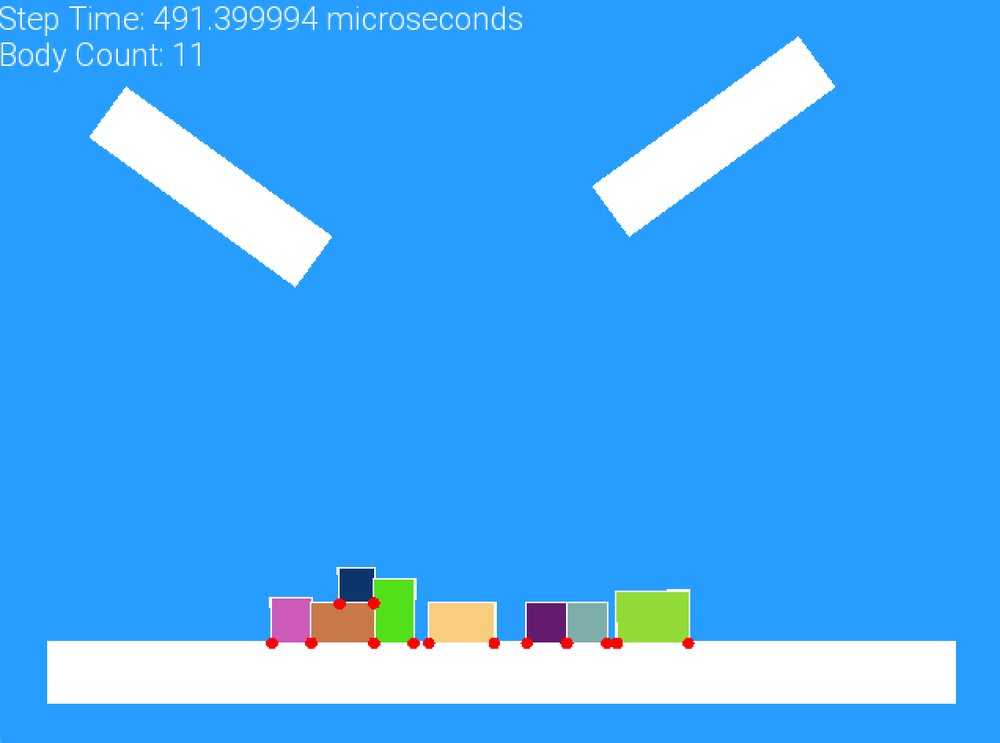

# 🔭 Physics2D

## ✏️ Description
Inside the Physics2D folder I have implemented my own 2D physics engine that includes collision detection with AABB as broad phase method and SAT for the narrow phase. Friction 
and rotational physics are implemented as well. This engine is able to handle collision with any convex shape. In addition to this, I have implemented ray casting to simulate the use
of a Lidar sensor. If you're interested in knowing how I implemented my physics engine, feel free to read my [blog post](https://www.riccardofeingold.com/implementing-a-2d-physics-engine-using-sfml-from-scratch/).

<!-- TODO: add how to install and use guide! -->

## 🔨 Upcoming Possible Features
- Air drag
- Collision detection with concave shapes
- Path finding algorithm: Goal is to enable the developer to add autonomous agents that can find the shortest path to a target
- Add RL algorithms such PPO and Q-Learning
- Springs
- Enable to use textures
- Make it compatible for ROS Noetic and ROS2 Humble
- Enable noise on Lidar sensor
  - Allow more customization of the Lidar sensor
- Joint simulation
- Soft body physics
- 2D legged robots
- Wheeled robots
- Quadcopter
- ✅ Implement a contact point class => currently the drawing of these points happens in the game.cpp file
- ✅ Implement a text class that handles the drawing using the SFML library