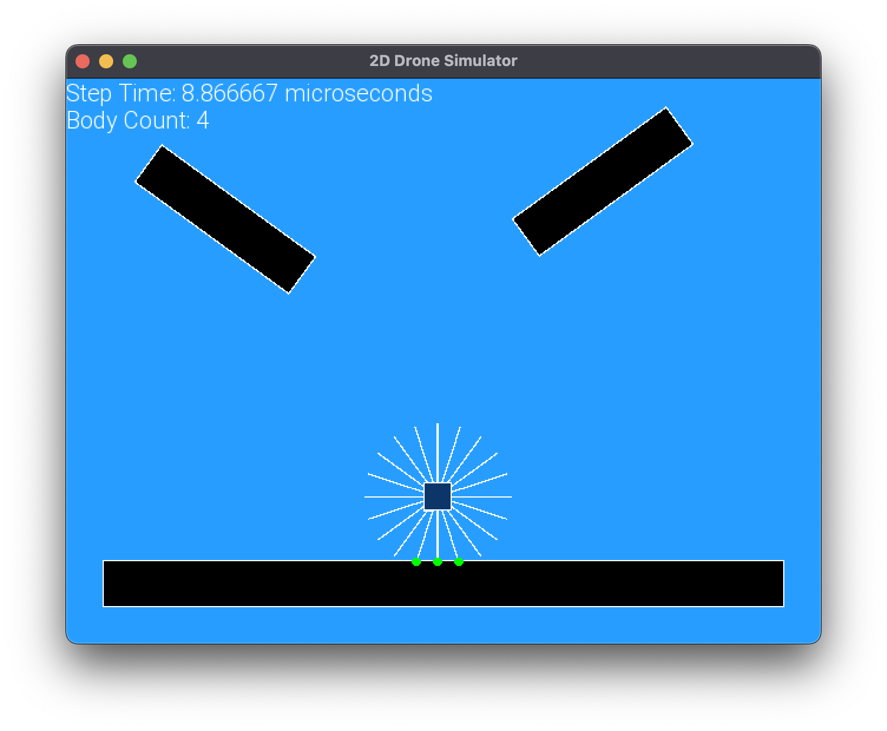

# 🕹️ 2D Drone Maze Running Game

## 🔭 Physics2D
Inside the Physics2D folder I have implemented my own 2D physics engine that includes collision detection with AABB as broad phase method and SAT for the narrow phase. Friction 
and rotational physics are implemented as well. This engine is able to handle collision with any convex shape.

